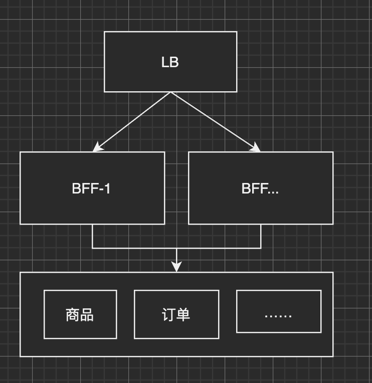

# 项目工程化相关
## 项目架构相关
### 架构调整
1. BFF 的继续推进
现有的项目架构如图

分析：
其实之前已经有过一部分的调整了，但是依然不够彻底，现在 BFF 里的改造不够彻底，有下面的问题：
1. 有太多业务相关逻辑，而不是数据的组装
2. 还有跟数据库交互的操作，应该剥离

### 目录结构
这块一直是我们做的比较差的一点，之前一直想要推进，但是推进的阻力比较大

### 项目实践
- error 处理: 这块对自己实践而言，最容易做到的，推广到全部部门使用比较困难
- errgroup 并发链路请求，已经在用了，优化成本最低、效果最明显
- 项目目录这块现在极为混乱，中途经历的调整比较多，也一直没有达成全团队的共识
- 过载保护这块可以立即用起来

# summary
课程覆盖：
- 微服务相关
    - 服务发现
    - 服务治理
    - 微服务日志、链路追踪
- Golang
    - Go 工程实践
    - Go 并发
    - Go 网络编程
    - Go runtime
- 分布式
    - 事务
    - 分布式缓存
- 项目实战
    - 评论系统
    - 播放历史
- 其他
    - DNS, CDN, 多活架构
    - Kafka

部分已经记录笔记，还需要继续完善

# 学习方法：
## 学习、记录部分
看视频还是得记笔记，
1. 记录视频与 PPT 的关系
2. 记录视频的关键时间节点
3. 记录、总结关键内容
## 实践部分
学习之后还是要立刻应用到实践中去，其中可以立即应用的是(有一些已经在用了，比如 errgroup, ELK 等)
- error 的处理
- errgroup 并发链路请求
- 过载保护

todo:
1. reference 应该怎么看
2. 记录完笔记之后，应该把心得分享出来
